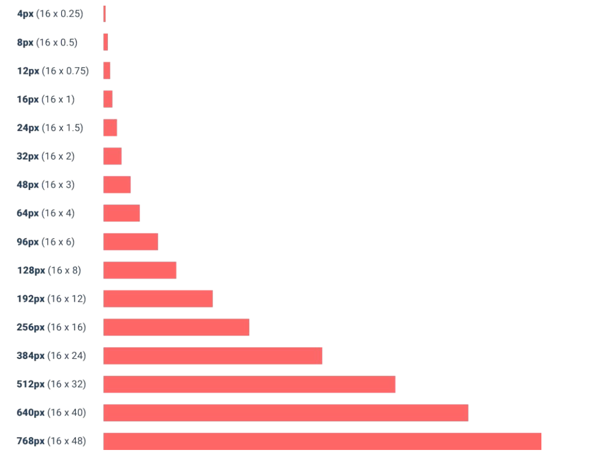

## 为界面留白

给界面上的元素更多的空间，显得不那么拥挤往往看起来更美妙。

留白的技巧是，先添加多一点的留白，后续根据视觉观感一步一步减少留白直到达到最佳的留白间距。

虽然拥有大量留白的设计会让人感觉更有设计感，更干净，但是某些情况下设计得紧凑也是有意义的。
比如要展示大量的数据，把这些数据打包在一起显示在整块屏幕上会更有意义。

## 建立间距和尺寸的系统

建立一个间距和尺寸的系统，可以让你在设计中保持一致性，提升设计效率。

通常系统当中的值以16px为基础值，每个值之间的最小差距为25%。下面给出一个常见的间距和尺寸系统

当我们在设计界面时要使用这个建立好的间距和尺寸系统，只需要将系统里面的值取出来将其应用到界面上，最终会得到一致性、干净的设计。

## 不必填满整个空间

学会压缩你的布局空间，有时候布局布满整个屏幕会显得很松散。

如果想要设计的是响应式的系统，可以先设计移动端的界面，再将其放到宽屏上进行适配。

## 不要做网格的奴隶

有些元素适合固定宽度，而不适合流式布局。

比如侧边栏适合固定宽度，主要内容的区域适合流式布局。

对于组件，除非你真的想让它按比例来缩放，否则千万别这样做。

还有说，对于组件，最好使用固定的宽度，这样可以让组件看起来更干净。

## 元素大小不是按比例调整的

为了适应不同的设备和分辨率，不要使用按比例调整元素大小的方法。

比如之前建立了尺寸和间距系统，但是为了实现最佳的效果，还是需要对组件设计进行微调，而不是单纯按照25%的比例放大缩小。

## 避免不明确的间距

简单来说就是，界面上的元素其实都是分了组的，所以间距会分为组内元素的间距和组与组之间的间距。

避免不明确的间距意思就是确保组与组之间的间距要明显大于组内元素之间的间距，这样会显得更清晰。