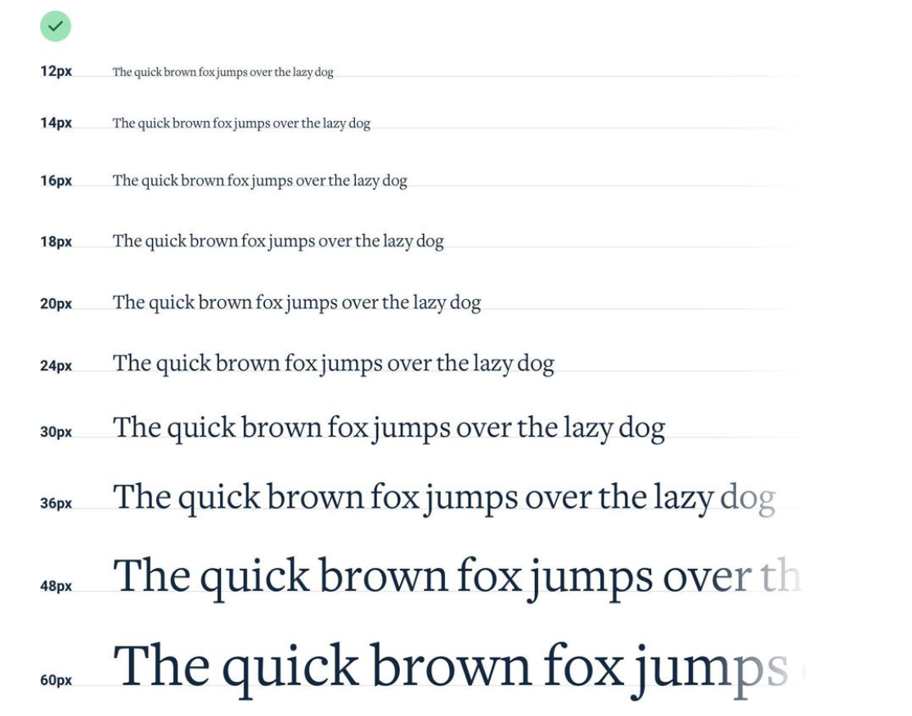

## 确立字体缩放比例

怎么去选字体缩放比例呢？

最常用的是手动选择一组字体大小的数据，还是以16px为基础大小。


在确定页面使用字体的大小时，将列表中的字体代入选择，可提升设计效率

在规定字体大小的列表时要避免使用em单位，因为em单位是相对于父元素的字体大小，而父元素的字体大小是动态变化的。

## 使用好的字体

对于设计来说，你不知道用什么字体的时候，那就选择中性的无衬线字体，比如Helvetica

避免在过多的字体当中做选择，忽略weight小于5的字体。

优化字体显示，比如标题文本通常字间距更小，内容文本字间距更大。

选择字体时要相信大众的智慧，可以按照受欢迎程度来选择字体。

也可以从其他的设计中来选择自己使用的字体。

## 避免段落横向长度过长影响阅读

过长的段落往往会影响阅读，在设计中规定一个max-length来限制段落长度。

## 字体对齐

通常，我们会使同一排的字体以基线对齐，即以字体底部的边缘对齐，而不是中线或者顶部对齐。

这样设计看起来会更整洁。不会影响界面整体观感。

## 字体行距设计也要成比例

一个好的行距会增强阅读体验，使段落更容易阅读。

比较窄的段落通常使用1.5倍行距，宽的段落通常使用2倍行距，这样会使眼睛更容易地找到文本内容。

字体大小也会影响行距的设计，当字体比较小的时候，可以通过加大行距来使内容更容易被发现，字体比较大的时候，不必通过行距来使内容更容易被发现，可以适当缩小行距。

## 不是每个链接都需要加着重样式

在页面上设计可点击的链接时，不必要都为其添加上着重样式，这样会使界面看起来很吓人。

可以通过其他方式来提示用户这是可点击的，比如可以使用更重的字体，可以通过添加悬停时样式来提示。。。

## 文本可读性

通常文本都是左对齐的，这样可读性会比较好。但是文本居中的情况也有，比如对于短文本和标题文本，居中会使得文本看起来更好。

但是对于长文本，居中会使得文本阅读起来很困难，所以，对于长文本，左对齐会更好。

而右对齐的情况适用于数字等类型，比如在表格中有数字类型，则可以使之右对齐。

使用连字符，会使文本中单词间隔不会因为换行而导致单词之间的空格变小或者变大。
```css
hyphens:auto;
```

## 字母间距也是可以设置的

使用css属性
```css
letter-spacing: 1px;
```
只说一点，通常大写字母之间字母间距要拉大一点，太紧凑不太容易阅读。

