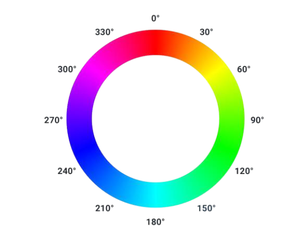
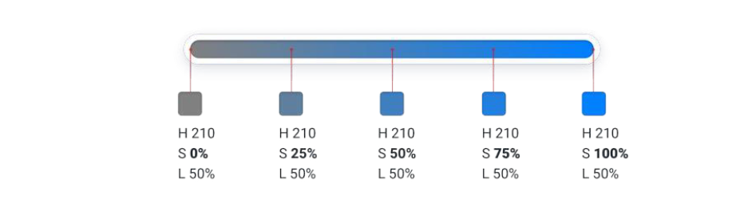
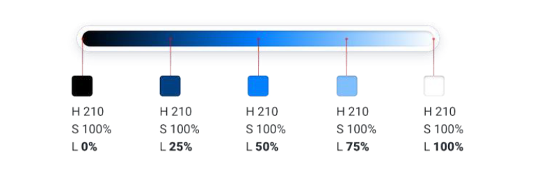

## 使用HSL来选择颜色

HSL通过人眼的直观感受来表示颜色，色调、饱和度和亮度。

H——Hue（色调）
色调是代表颜色在色轮上的位置，以度来表示，取值范围为0-360。

S——Saturation（饱和度）
饱和度代表色彩的纯度，取值范围为0-100%，0%表示灰色，100%表示完全饱和。

L——Lightness（亮度）

亮度表示色彩的明暗程度，取值范围为0-100%，0%表示黑色，100%表示白色，50%表示正常亮度。

## 界面上需要很多种颜色

一般来说可能需要10种颜色，每种颜色需要5-10种色调。

大致可以分为三类

1. 灰色
文本、背景、面板、表单控件，基本都是使用的灰色。
为了应对这些灰色，我们需要很多种灰色，可能需要8-10种，从深灰色逐渐改变参数到白色

2. 主色
主色是整个界面的核心，一般会使用一种或两种主色，这会成为整个产品的风格。
我们会为这个主色定义多种色调，一般需要5-10种。
超浅色可以作为警报等的有色背景，深色适合作为文本，中间色适合作为按钮等元素

3. 强调色
作为不同于主色的强调色，向用户传达不同的东西。
比如，红色作为警告色，绿色作为成功色，换色作为警告色

## 预设颜色主题

不要试图去临时定义颜色，而是使用预设的颜色主题。

那怎么去预设颜色主题呢？

方法是通用的，先选定一个基础颜色，选择基础色比较好的方式是选择适合按钮背景的颜色，不是最明亮的，也不是比较浅色的。

选定基础颜色后，在深色、基础色、浅色之间填充出一组渐变的颜色。
最好的方式是选定九个颜色，每个颜色之间的值差值相等，灰色同理。

但是最好做一些微调，因为这些东西并不都讲科学。

## 不要让亮度扼杀饱和度

不想让颜色看起来褪色，需要随着亮度远离50%而增加饱和度

使用渐变颜色时，可以在色调上进行旋转调整。

## 灰色也不一定就是灰色

传统的灰色是饱和度只有0的一组颜色。但是经常用到的灰色往往都带有一定的饱和度，这样的颜色会使灰色带有一点“温度”，带点蓝色是冷峻。带点黄色是温暖。

## 注意界面上文本和背景的对比度

通常来说，如果页面上的文字小于18px，那么对比度至少4.5：1，如果是更大的文本，对比度至少要有3：1
检查对比度的网站如下
[Adobe 检查对比度](https://color.adobe.com/zh/create/color-contrast-analyzer)

在彩色背景上使用白色文本的时候， 会发现需要调整背景色到很深的情况下，对比度才会达到要求。解决办法是，在浅色的深色背景上使用黑色文本。

## 依赖颜色来支持设计，但不要只依赖于颜色

颜色搭配图标将是绝杀，红色代表下降，绿色代表增长，但是并不能完全表达这层意思，所以为其添加图标更能使意思更加明显。

还有在使用图表的时候，与其添加多张颜色，不如使用多种颜色的不同饱和度。