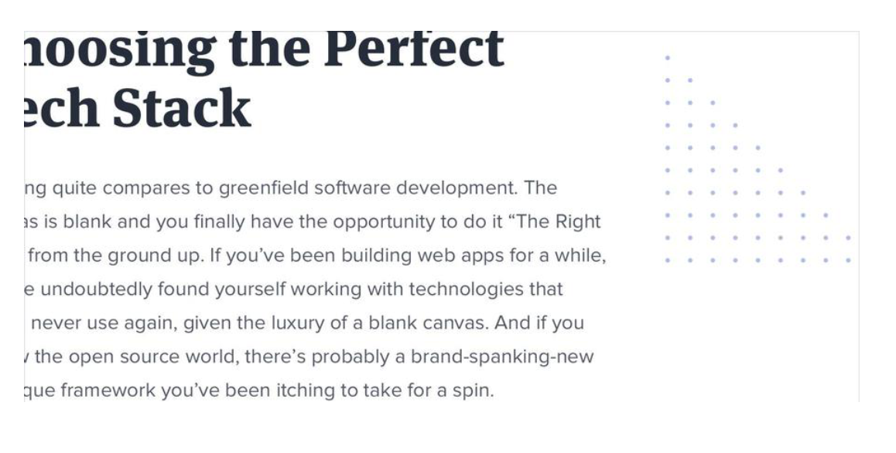

## 为默认样式做个改头换面

比如

有一个列表，就可以把默认样式以图标替代

如果有一段引用，可以用图标的引号把内容括起来

比如有一个链接，也可以做一些花里胡哨的事情。

## 为了实现着重效果可以为边框添加色块

这样会使界面看起来没有那么乏味，更有设计感

## 为背景增加一点趣味

可以为背景换一个背景色，这样整体看起来会更活泼。加一个活泼的背景色不止对卡片适用，也可以对整页的背景添加颜色。甚至可以使用轻微的渐变，渐变色的跨度最好不要在色调上超过30度。

另一种方式是在背景上添加一些可重复的元素。

或者，在背景上添加一个简单的图案，起一个装饰的作用。

## 不要忽视页面数据为空的状态

这个页面时用户第一次访问看到的页面，所以一定要设计好，不要让空列表页面显得太无聊。

比如数据为空时就要给用户创建数据的操作指引

数据为空时，不要给用户操作选项的机会

## 元素之间少用边框

代替边框的方式有很多种，试举几例

1. 阴影：通过阴影分隔元素
2. 使用不同颜色的背景色
3. 元素之间添加更大的间距

去掉边框（border）后，整个页面看起来会更统一。

